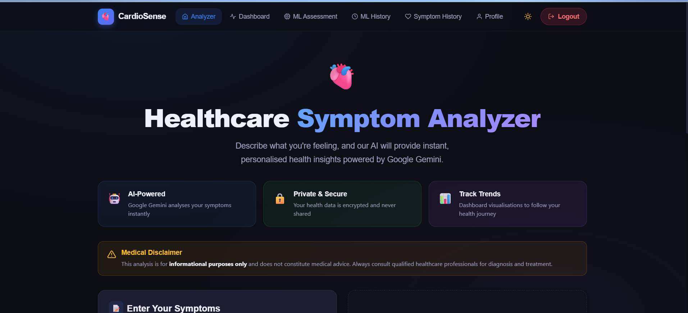
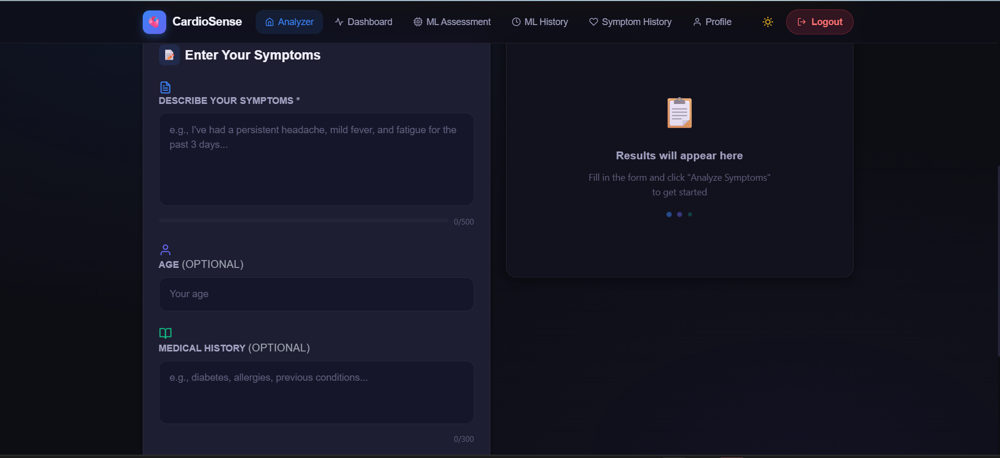
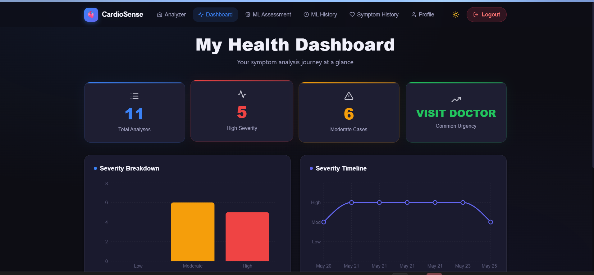
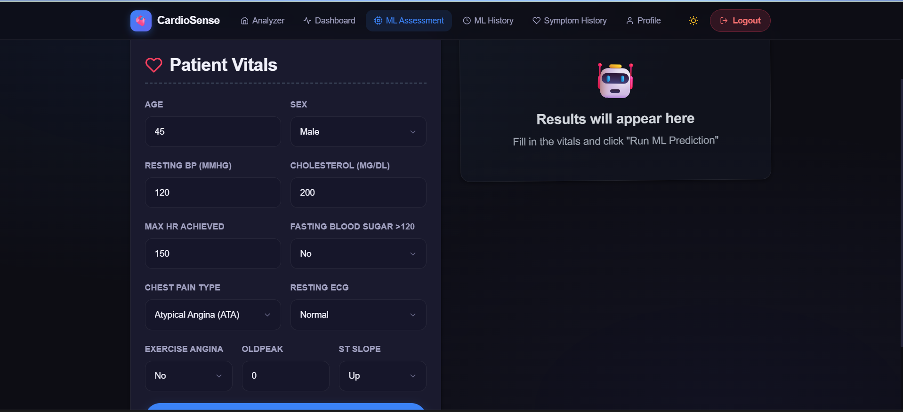
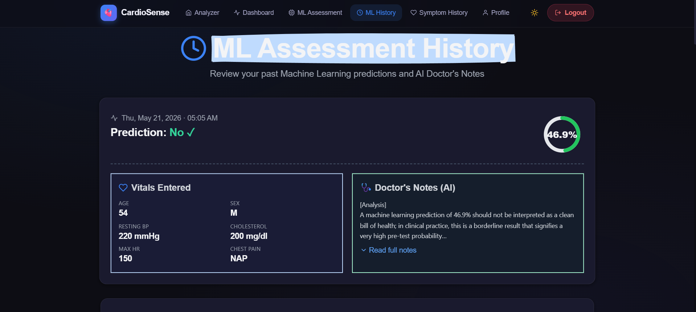

# CardioSense

CardioSense is a polished healthcare application that combines AI-powered symptom analysis with cardiac risk prediction. It features a beautiful dark UI and a full workflow for users to analyze symptoms, review health history, and run ML-based heart risk predictions.

## 🌟 Highlights

- AI symptom analyzer powered by Google Gemini
- Machine learning heart disease predictor with personalized vitals input
- User auth, profile photo upload, and saved history
- Interactive dashboard with severity trends and analysis summaries
- Modern Next.js frontend with Tailwind styling

## 📸 Screenshots

### 1. Home / Analyzer

A clean symptom analyzer landing screen with instant AI analysis guidance.

### 2. Symptom Form

Enter symptoms, age, and medical history, then view structured AI insights.

### 3. Health Dashboard

Track total analyses, severity counts, and timeline trends in one view.

### 4. ML Assessment

Submit vitals and cardiac risk details for a machine learning prediction.

### 5. ML History

Review past predictions, AI doctor notes, and vital signs in a history card.

## 🧩 Project Structure

- `main.py` — FastAPI backend and AI/ML endpoint logic
- `auth.py` — JWT auth helpers and password hashing
- `database.py` — SQLAlchemy models and SQLite configuration
- `schemas.py` — Pydantic request/response schemas
- `requirements.txt` — Python package dependencies
- `frontend/` — Next.js web application
- `ml_models/` — saved ML model, scaler, and feature columns
- `uploads/` — stored profile photo uploads
- `images/` — local screenshot assets for README and documentation

## 🚀 Setup

### Backend

1. Create and activate a Python virtual environment:

```bash
python -m venv .venv
.\.venv\Scripts\activate
```

2. Install Python dependencies:

```bash
pip install -r requirements.txt
```

3. Create a `.env` file from `.env.example` and add your Gemini API key:

```text
GEMINI_API_KEY=your_api_key_here
HOST=0.0.0.0
PORT=8000
DEBUG=False
```

4. Run the API:

```bash
uvicorn main:app --reload
```

The backend runs at `http://127.0.0.1:8000`.

### Frontend

1. Navigate to frontend:

```bash
cd frontend
```

2. Install dependencies:

```bash
npm install
```

3. Start the Next.js app:

```bash
npm run dev
```

Open `http://localhost:3000` to view the app.

## 🔌 API Endpoints

### Authentication

- `POST /register` — Register a new user
- `POST /token` — Login and get a bearer token
- `GET /users/me` — Get authenticated user details
- `POST /users/me/photo` — Upload a profile photo

### Health Analysis

- `POST /analyze-symptoms` — Analyze symptoms using Gemini AI
- `GET /history` — Get health analysis history

### ML Prediction

- `POST /ml-predict` — Predict heart disease likelihood
- `GET /ml-history` — Get ML prediction history

### Utility

- `GET /` — API root
- `GET /health` — Health status check

## 🧪 Example ML Payload

```json
{
  "age": 45,
  "sex": "M",
  "chest_pain_type": "ATA",
  "resting_bp": 120,
  "cholesterol": 200,
  "fasting_bs": 0,
  "resting_ecg": "Normal",
  "max_hr": 150,
  "exercise_angina": "N",
  "oldpeak": 0,
  "st_slope": "Up"
}
```

## 📌 Notes

- The AI assistance is informational only and not medical advice.
- A local SQLite database file (`cardiosense.db`) stores user history.
- The app uses Google Gemini API and requires a valid API key.

## ✅ Recommended Improvements

- Add explicit frontend validation for symptom input and vitals
- Add full user settings and profile management
- Deploy backend and frontend together in production
- Add unit and integration tests for both API and UI

## 📄 License

Add your license details here.
